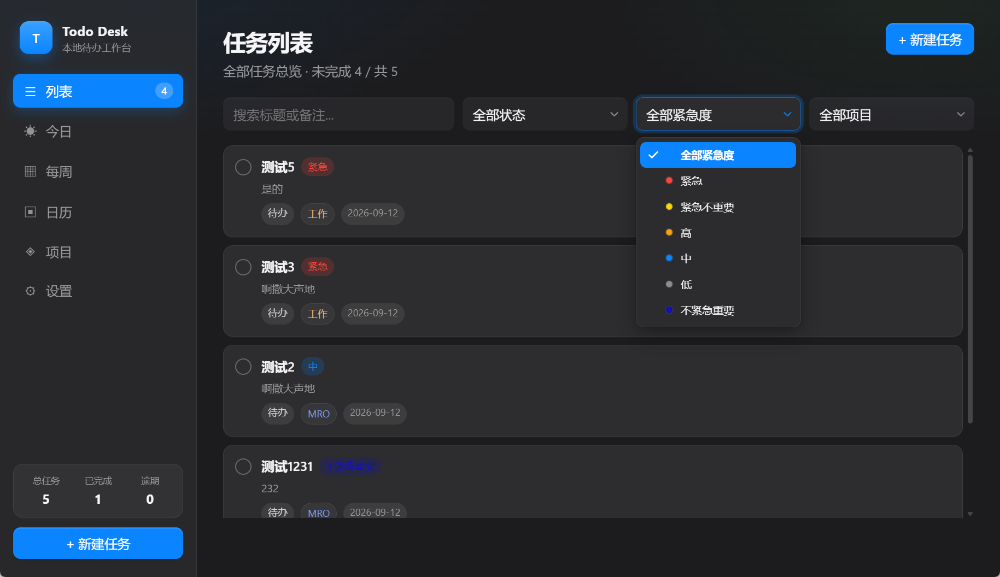
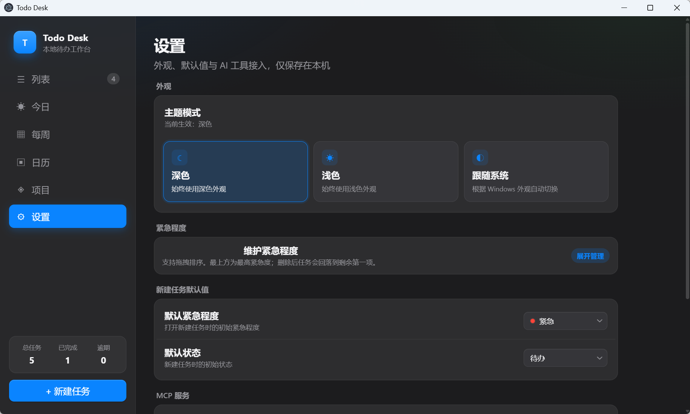

# Todo Desk

Windows 本地待办管理桌面工具（Electron + React + SQLite）。

## 功能

- **列表**：全部任务总览，支持状态 / 紧急度 / 项目 / 关键词筛选
- **今日**：今日安排、进度条、逾期提醒、紧急任务统计
- **每周**：按周一～周日分列看板，可按天添加任务
- **日历**：月视图选日查看，点击日期右侧显示当日任务
- **项目**：按项目分组看板，支持新建 / 编辑 / 删除项目与颜色
- **琐事**：本地备忘，支持分类、置顶、归档
- 任务支持：新建、编辑、删除、完成切换、状态（待办/进行中/已完成）、紧急程度（紧急/高/中/低）、截止日期、备注、所属项目

## 界面预览





## 环境要求

- Node.js 18+（推荐 22+，当前已在 Node 22 / Electron 36 验证）
- Windows 10/11

## 安装与启动

```powershell
cd F:\traeWorkData\todo-desktop
npm install
npm run build
npm start
```

开发模式（热更新界面）：

```powershell
npm run dev
```

## 数据位置

- 打包版：`%APPDATA%\Todo Desk\data\todo.db`
- 开发模式：`%APPDATA%\todo-desktop-dev\data\todo.db`

可直接备份该文件，也可在设置中导出 JSON。

## 技术栈

- Electron 36
- React 19 + Vite 6
- Node 内置 `node:sqlite`（无需额外原生编译）
- 可选：MCP Server，供 AI 工具读写本机数据
